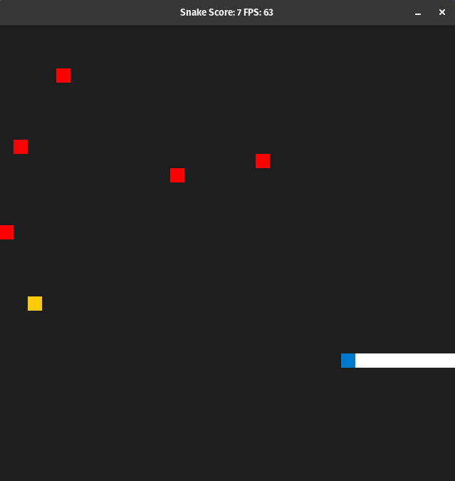

# Snake Game

The code for this repo was inspired by [this](https://codereview.stackexchange.com/questions/212296/snake-game-in-c-with-sdl) excellent StackOverflow post and set of responses.

## Dependencies for Running Locally
* cmake >= 3.7
  * All OSes: [click here for installation instructions](https://cmake.org/install/)
* make >= 4.1 (Linux, Mac), 3.81 (Windows)
  * Linux: make is installed by default on most Linux distros
  * Mac: [install Xcode command line tools to get make](https://developer.apple.com/xcode/features/)
  * Windows: [Click here for installation instructions](http://gnuwin32.sourceforge.net/packages/make.htm)
* SDL2 >= 2.0
  * All installation instructions can be found [here](https://wiki.libsdl.org/Installation)
  * Note that for Linux, an `apt` or `apt-get` installation is preferred to building from source.
* SDL_ttf >= 2.0
  * All installation instructions can be found [here](https://www.libsdl.org/projects/SDL_ttf/)
  * Note that for Linux, using package manager installation is preferred to building from source. for fedora `dnf install SDL2_ttf SDL2_ttf-devel`. for ubuntu `apt-get install libsdl2-ttf-dev`

* gcc/g++ >= 5.4
  * Linux: gcc / g++ is installed by default on most Linux distros
  * Mac: same deal as make - [install Xcode command line tools](https://developer.apple.com/xcode/features/)
  * Windows: recommend using [MinGW](http://www.mingw.org/)

## Basic Build Instructions

1. Clone this repo.
2. Make a build directory in the top level directory: `mkdir build && cd build`
3. Compile: `cmake .. && make`
4. Run it: `./SnakeGame`.

 
 

## Added Features
- Holding the arrow key speed up the snake movment.
- Added a menu using an external library SDL_TTF.
- Added a top five scores that saved to a file.
- Added items (red squares) that could end the game for the player.

 
 

## Project Rubric
### Loops, Functions, I/O
 1. The project demonstrates an understanding of C++ functions and control structures.
    - from line 19 to 21 and 48, 51 and thoughout the project there are more.
 2. The project reads data from a file and process the data, or the program writes data to a file.
    - the project read data from scoredb file the code can be found in line 84 in main.cpp and writes data in line 106

  3. The project accepts user input and processes the input.
     - using the enter key and the arrows keys the code can be found in controller.cpp in line 17, 80

### Object Oriented Programming
  1. The project uses Object Oriented Programming techniques.
     - the codes can be found in menu.h and menu.cpp files
  
  2. Classes use appropriate access specifiers for class members.
     - the codes can be found in menu.h, menu.cpp
  
### Memory Management
  1. The project makes use of references in function declarations.
     - function uses pass by refrence renderer.cpp line 92, line 39 pass by refrence (passing items), controller.cpp line 13
  
  

 
 

## Resources used
 - the snake movment speed
https://wiki.libsdl.org/SDL_GetKeyboardState

 - font color text render
https://www.libsdl.org/projects/SDL_ttf/docs/SDL_ttf_47.html 

 - SDL font ttf
https://www.libsdl.org/projects/SDL_ttf/

 - https://stackoverflow.com/questions/29056249/how-do-i-check-for-sdl2-ttf-in-cmakelists-txt

 - https://raw.githubusercontent.com/Deraen/ohj2710/master/cmake_modules/FindSDL2TTF.cmake

 - https://www.libsdl.org/release/SDL-1.2.15/docs/html/guidetimeexamples.html